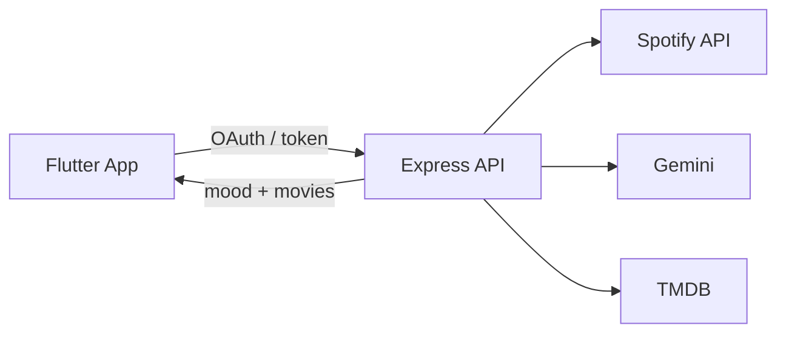

# CineVibe

Spotify dinleme geçmişine göre ruh halini analiz edip film öneren bir uygulama.

Son dinlediğin şarkılar Gemini ile yorumlanır, TMDB üzerinden o moda uyan filmler listelenir.

> *Music meets Cinema*

## Diller

| Katman | Dil | Not |
|--------|-----|-----|
| Frontend (uygulama) | **Dart** | Flutter ile yazıldı |
| Backend (API) | **JavaScript** (Node.js) | Express sunucusu |
| Android native | **Kotlin** | Flutter platform katmanı |
| iOS / macOS native | **Swift** | Flutter platform katmanı |

Asıl iş mantığı **Dart** (UI) ve **JavaScript** (API) tarafında.

## Özellikler

- Spotify ile giriş (OAuth)
- Son dinlenen parçalardan ruh hali analizi (Google Gemini)
- Moda göre film önerileri (TMDB)
- Flutter arayüz: giriş, yükleme ve öneri ekranları
- Yerel watchlist (`SharedPreferences`)

## Mimari

```
CineVibe2/
├── backend/              # Express API
│   ├── index.js          # Spotify + Gemini + TMDB endpoint'leri
│   ├── package.json
│   └── .env.example
└── frontend/             # Flutter uygulaması
    └── lib/
        ├── main.dart
        ├── theme.dart
        ├── screens/      # login, loading, recommendation
        └── services/     # API + watchlist
```

**Akış:** Spotify login → son dinlenen parçalar → Gemini mood analizi → TMDB araması → öneriler



## Teknolojiler

### Frontend
- Flutter / Dart (SDK ^3.9)
- Provider
- Google Fonts, animate_do, flutter_spinkit
- http, url_launcher, shared_preferences

### Backend
- Node.js + Express 5
- dotenv, cors, axios
- `@google/generative-ai` (Gemini 1.5 Flash)

### Harici servisler
- Spotify Web API
- Google Gemini
- The Movie Database (TMDB)

## Gereksinimler

- Node.js 18+
- Flutter SDK (Dart 3.9+)
- Spotify Developer uygulaması
- Google Gemini API anahtarı
- TMDB API anahtarı

## Kurulum

### 1. Backend

```bash
cd backend
cp .env.example .env
npm install
```

`.env` dosyasını doldur:

```env
PORT=3000
SPOTIFY_CLIENT_ID=
SPOTIFY_CLIENT_SECRET=
SPOTIFY_REDIRECT_URI=http://localhost:3000/callback
GEMINI_API_KEY=
TMDB_API_KEY=
```

| Değişken | Nereden alınır |
|----------|----------------|
| `SPOTIFY_CLIENT_ID` / `SECRET` | [Spotify Developer Dashboard](https://developer.spotify.com/dashboard) |
| `GEMINI_API_KEY` | [Google AI Studio](https://aistudio.google.com/apikey) |
| `TMDB_API_KEY` | [TMDB Settings → API](https://www.themoviedb.org/settings/api) |

Spotify uygulamasında Redirect URI olarak `http://localhost:3000/callback` ekle.

Sunucuyu başlat:

```bash
npm start
```

API: `http://localhost:3000`

### 2. Frontend

```bash
cd frontend
flutter pub get
flutter run
```

| Platform | Backend adresi |
|----------|----------------|
| Android emülatör | `http://10.0.2.2:3000` |
| iOS / web / desktop | `http://localhost:3000` |

Adresler `frontend/lib/services/api_service.dart` içinde ayarlı.

## API

| Method | Endpoint | Açıklama |
|--------|----------|----------|
| `GET` | `/login` | Spotify OAuth başlangıcı |
| `GET` | `/callback` | Auth kodunu token'a çevirir → `{ access_token, refresh_token }` |
| `POST` | `/analyze` | Body: `{ "accessToken" }` → mood + film listesi |

### `/analyze` örnek yanıt

```json
{
  "mood": "Melancholic",
  "description": "...",
  "tracks": [
    { "name": "Song", "artist": "Artist" }
  ],
  "movies": [
    {
      "id": 123,
      "title": "Movie Title",
      "overview": "...",
      "poster_path": "https://image.tmdb.org/t/p/w500/...",
      "release_date": "2024-01-01"
    }
  ]
}
```

## Geliştirme notları

- Login ekranında Spotify akışı henüz mock; gerçek OAuth için `/login` endpoint'ine bağlanması gerekiyor.
- API anahtarlarını asla commit etme; `.env` gitignore'da, şablon için `.env.example` kullan.
- Backend çalışmadan `/analyze` çağrıları başarısız olur — önce `npm start`.

## Lisans

ISC
